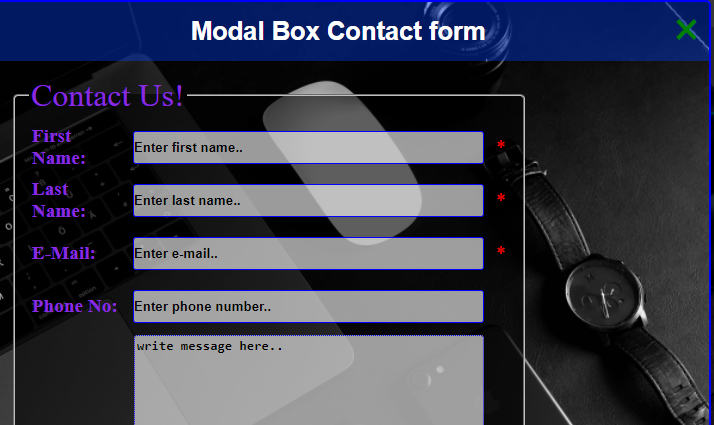

# Modal Registration form
This is my first modal project and my second repository.
Please support share and like.
You are allowed to use this form for any purpose.

This form comes with javascrypt, html5, css3 and php validation.
you may modify the code improve it and enjoy..:)

# Modifying the Contuct form.
 for validation purposes you can insert the red
 star as a sign of a required field by adding this code: 
                  *
                  as shown below:
                  
Screenshots
---
   ### HTML
  
the red is just to show/for example.

Do the same in the Contact form 2 1.0.1
---